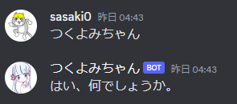
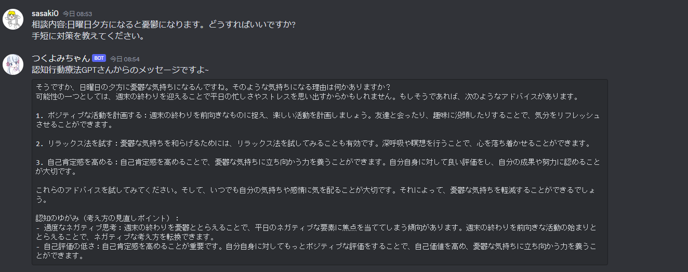
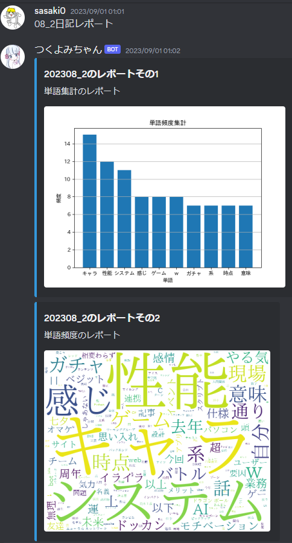
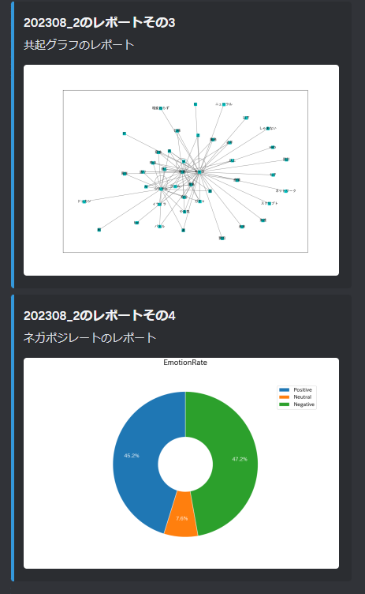
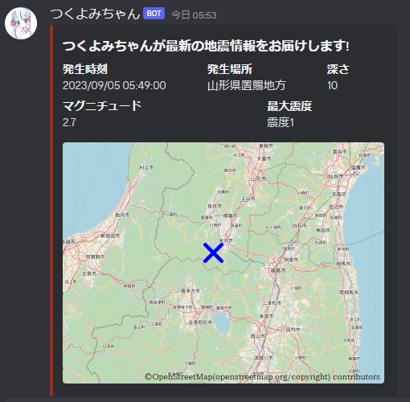
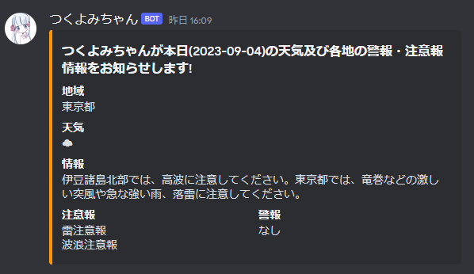
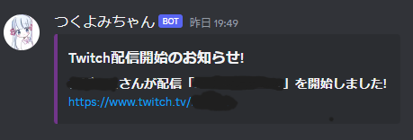

# つくよみちゃんbot Discord版
## 概要
[つくよみちゃん会話データ](https://tyc.rei-yumesaki.net/material/kaiwa-ai/)を用いたDiscord用のAIチャットbot, テキストマイニングツール。

おまけ機能として地震速報, 天気予報, Twitch配信通知を搭載。

### モデル概要
- ベースモデル：rinna/japanese-gpt2-medium
- 使用データ：[つくよみちゃんの会話データセット](https://tyc.rei-yumesaki.net/material/kaiwa-ai/)

### 機能一覧
- つくよみちゃんAIとのチャット機能

- お悩み相談機能 (OpenAI ChatGPT(GPT3.5-turbo)と連携)

- テキストマイニング処理機能(GoogleスプレッドシートAPI連携)

- 地震速報の自動通知

- 天気予報・注意報/警報情報の自動通知

- Twitch配信開始の自動通知 (指定のストリーマーのみ)

# クレジット
会話AIの作成には、フリー素材キャラクター「つくよみちゃん」が無料公開している会話テキストデータセットを使用しています。

■つくよみちゃん会話AI育成計画

https://tyc.rei-yumesaki.net/material/kaiwa-ai/

© Rei Yumesaki

# 著作者
ghostfm3
